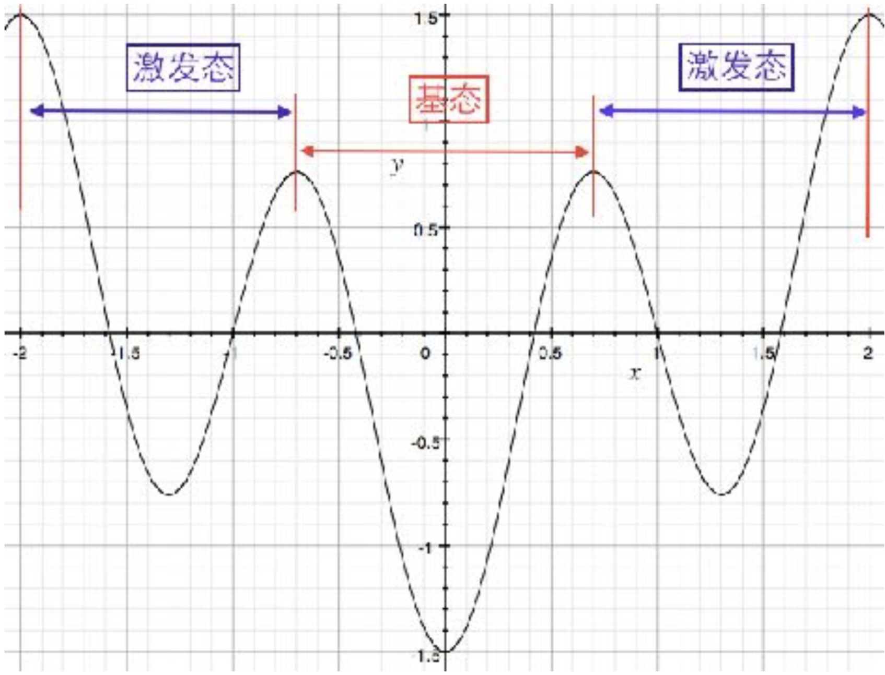
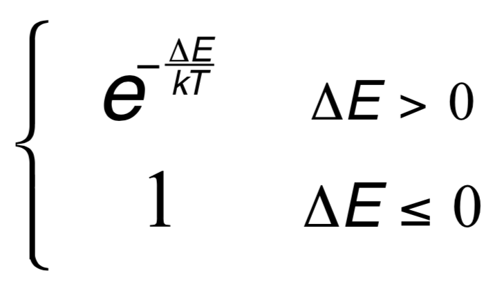

# Monte Carlo Walk

### By Dai Zhirui

### Date: 10-14-2017

## Introduction

This program is used to simulate *Monte carlo Walk* based on the following conditions:

1. The range of the simulated area is a circle of which the radius is *2D*.

1. The energy of the particle obeys the formula:  
E = -0.5cos(0.5$\pi$d)-cos(1.5$\pi$d)  when -2<d<2  
E = $\infty$ when d$\leq$-2 or d$\geq$2  

1. The possibility to execute each step is based on:

After executing this simulation, the possibility of the stable state will be output and the possibility of each step will be stored in the file ***possibility_stable_state.out*** as default.

Following parameters of the simulation will be saved at the beginning of the file mentioned above ( default: ***possibility_stable_state.out*** ).

- total step
- length of single step
- the file name of the file containing the original data

## Options

This program provides the following options:

| Option Name | Description | Default |
| ----------- |:-----------:| -------:|
| -h | To print the help ||
| -l | To setup the length of the simulation | 0.5 |
| -n | To setup the length of the simulation | 1000|
| -o | To setup the name of the output file, ineffective when using [-s 0]| monte\_carlo\_data.dat|
| -O | To setup the name of the file containing the possibility of stable state | possibility\_stable\_state.dat |
| -s | To setup whether to save the original data of the simulation, 0=Not save, 1=save | 1(save the data) |